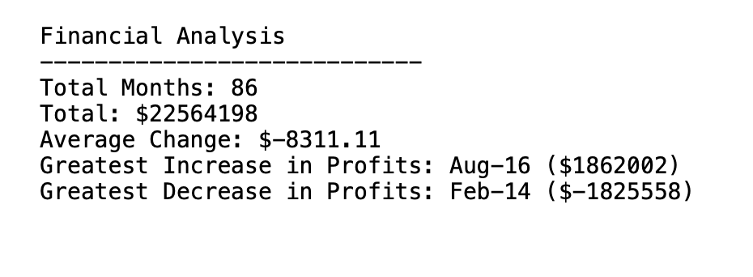
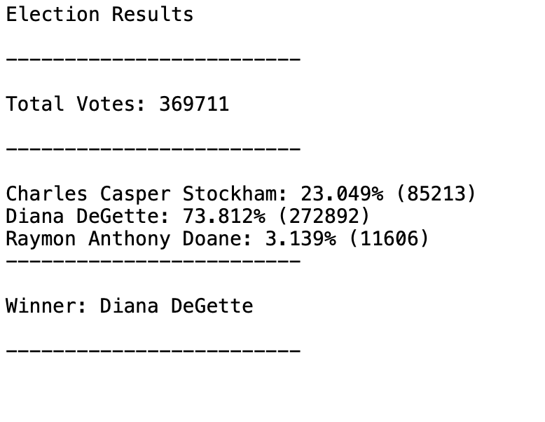

# Python-Challenge

A Python project for analyzing financial and election data using two separate scripts.

## Table of Contents
##### Introduction
##### Features
##### Requirements
##### Financial Data Analysis Task
##### Election Data Analysis Task
##### Contributing
##### License

## Introduction
This project consists of two Python scripts designed to analyze financial and election data from CSV files. The scripts perform various computations to generate informative summary results. All results are printed to the terminal and also exported as text files for further reference.

## Features
- Analyze financial data from a CSV file and generate summary results.
- Analyze election data from a CSV file and generate summary results.
- Export summary results as text files for easy sharing and reference.

## Requirements

Python (version 3.10.9)

## 1.	Financial Data Analysis Task
This script analyzes financial records when presented with a CSV file containing two columns: "Date" and "Profit/Losses" to calculate the following values:
   
- Total number of months included in the dataset.
- The net total amount of "Profit/Losses" over the entire period.
- The changes in "Profit/Losses" over the entire period, followed by the average of those changes.
- The greatest increase in profits (date and amount) over the entire period.
- The greatest decrease in profits (date and amount) over the entire period.

##### Output

### Usage
Here's how to use the Financial Data Analysis Script:
- Ensure that the CSV file contains the financial data in the appropriate format (two columns: "Date" and "Profit/Losses").
- Paste the code into a Python code editor.
- Run the code.
- The script will analyze the financial data and generate the results, which will be displayed in the terminal and saved in a text file.

## 2.    Election Data Analysis Task
This script analyzes votes data presented with a CSV file containing three columns: "Ballot ID", "County", and "Candidate" to calculate the following values:

- The total number of votes cast.
- A complete list of candidates who received votes.
- The percentage of votes each candidate won.
- The total number of votes each candidate won.
- The winner of the election based on the popular vote.

##### Output

### Usage
Here's how to use the Election Data Analysis Script:
- Ensure you have the appropriate CSV file containing the election votes data with columns for “Ballot ID”, "Location”, and “Candidate Name”
- Paste the code into a Python code editor.
- Run the code.
- The script will analyze the election data and generate the results, which will be displayed in the terminal and saved in a text file.

### Contributing

Contributions to these projects are highly encouraged! If you wish to contribute, please follow these guidelines:

- Fork the respective repository for the Financial or Election Data Analysis Script and clone it locally.
- Create a new branch for your feature or bug fix.
- Commit your changes with descriptive commit messages.
- Push your branch to your forked repository.
- Submit a pull request to the original repository.
- Please ensure that your code adheres to the project's coding style and conventions.

If you encounter any issues or have suggestions for improvements, please open an issue on the GitHub repository.

### License
These projects are licensed under the MIT License. Feel free to use, modify, and distribute the code as per the terms of the license. 

